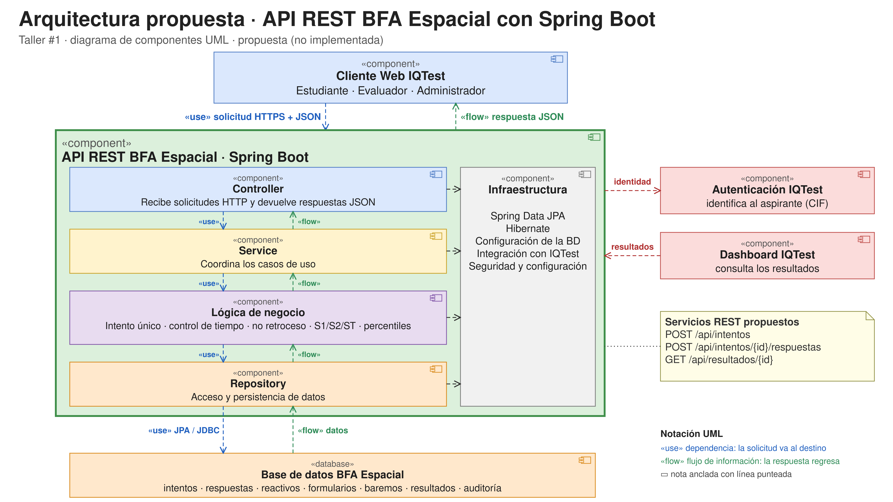
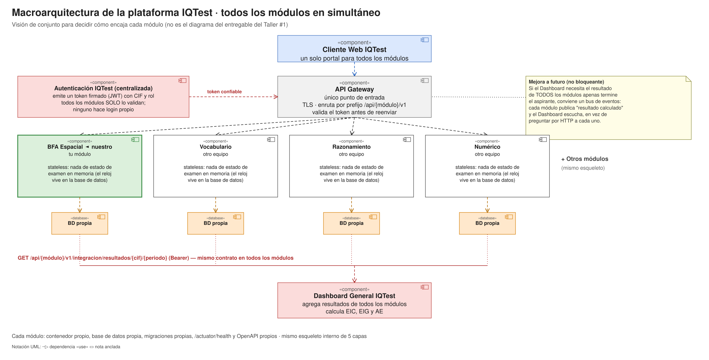

# Arquitectura propuesta

> **Propuesta del Taller #1.** Nada de lo descrito aquí está implementado: son las capas, clases y servicios que se construirán en la siguiente etapa.

Se propone transformar el módulo **BFA Espacial** en una **API REST con Spring Boot** que un cliente web consume por HTTP/HTTPS con datos en JSON. La API es la única que accede a la base de datos y es donde viven las reglas del BFA.

*Diagrama de componentes UML (editable en [`diagramas/arquitectura-bfa.drawio`](../diagramas/arquitectura-bfa.drawio)). Las flechas `«use»` son la solicitud; las `«flow»`, la respuesta que regresa por el mismo camino.*

## Componentes

| Componente | Qué es |
|---|---|
| **Cliente Web IQTest** | Interfaz que usan el estudiante, el evaluador y el administrador. Hace las solicitudes HTTP; no accede a la base de datos ni a la lógica |
| **API REST BFA Espacial** | Aplicación Spring Boot que expone los servicios REST y aplica las reglas del BFA |
| **Base de datos BFA Espacial** | Almacena intentos, respuestas, reactivos, formularios, baremos, resultados y auditoría |
| **Autenticación IQTest** (externo) | Identifica al aspirante (CIF). El módulo no hace login propio |
| **Dashboard IQTest** (externo) | Consulta los resultados del módulo |

## Comunicación

- **Cliente ↔ API:** **HTTP/HTTPS** con **JSON** en la solicitud y en la respuesta.
- **API ↔ Base de datos:** Repository → **JPA / Hibernate** → **JDBC**. Solo la API accede a la base de datos.

## Macroarquitectura de la plataforma (todos los módulos en simultáneo)

> Nota de arquitectura, para tener claro cómo encaja BFA Espacial cuando **todos los módulos-test de IQTest corren al mismo tiempo**, atendiendo a muchos aspirantes en paralelo. No es el diagrama que pide el entregable del Taller #1 (ese es el de arriba, específico de nuestro módulo); es la vista de conjunto detrás de esa decisión.

IQTest no es una sola aplicación: es un **portal** con varios módulos de prueba (BFA Espacial, Vocabulario, Razonamiento, Numérico…), cada uno construido por un equipo distinto, que deben poder ejecutarse, desplegarse y fallar de forma independiente sin tumbar a los demás.

### Decisiones y por qué

| Decisión | Alternativa descartada | Motivo |
|---|---|---|
| **Un servicio REST independiente por módulo** (no un monolito único con todos los tests) | Una sola aplicación Spring Boot con todos los módulos adentro | Equipos distintos deben poder programar y desplegar sin pisarse; si un módulo falla o se satura, los demás siguen funcionando |
| **Un API Gateway como único punto de entrada** | El cliente le habla directo a cada módulo | El cliente no necesita saber dónde vive cada módulo; el Gateway centraliza TLS y enruta por prefijo (`/api/{módulo}/v1`) |
| **Identidad centralizada con token firmado (JWT)**, no sesión propia por módulo | Cada módulo maneja su propio login | Con varios módulos y varias instancias de cada uno, una sesión guardada en memoria de un servidor no la pueden leer los demás; un token firmado sí es válido para cualquiera sin compartir estado |
| **Una base de datos por módulo** | Una sola base de datos compartida por todos los módulos | Un cambio de esquema en un módulo no debe romper a otro; cada equipo migra la suya (p. ej. con Flyway) sin coordinarse; una consulta pesada de un módulo no compite por rendimiento con otro |
| **El Dashboard consulta a cada módulo por su propio endpoint**, nunca lee su base de datos | El Dashboard con acceso directo a las bases de datos de los módulos | El Dashboard no debe conocer el esquema interno de ningún módulo; cada uno expone `GET /api/{módulo}/v1/integracion/resultados/{cif}/{periodo}` con el mismo contrato |
| **Cada instancia de módulo sin estado (stateless)** | Guardar el progreso del examen en la memoria del servidor | Si el Gateway balancea entre varias instancias del mismo módulo, el aspirante no debe "perder" su examen por caer en otra instancia; el cronómetro y las respuestas viven en la base de datos, no en memoria |
| **Contenedor propio por módulo** (Docker, y orquestados en producción) | Todo en un mismo proceso/servidor | Permite escalar, actualizar o reiniciar un módulo sin afectar a los demás, y darle a cada uno los recursos que su carga real necesita |

### Contrato mínimo que todo módulo debe cumplir

1. Prefijo de ruta propio: `/api/{módulo}/v1`.
2. No implementa su propio login: valida el token/sesión que emite la Autenticación IQTest.
3. Expone un endpoint de integración estándar para el Dashboard, con el mismo formato de respuesta que los demás módulos.
4. Expone una ruta de salud (`/actuator/health` o equivalente) para que el Gateway/orquestador sepa si está disponible.
5. Documenta su API (OpenAPI), para que otros equipos sepan qué existe sin leer el código.
6. Tiene su propia base de datos y sus propias migraciones; ningún módulo lee la base de datos de otro.
7. Ninguna instancia guarda en memoria el estado de un examen en curso.

### Mejora a futuro (no bloqueante para este taller)

Si más adelante el Dashboard necesita el resultado de **todos** los módulos apenas un aspirante termine (para calcular los compuestos EIC, EIG y AE), conviene mover ese caso de una consulta síncrona por HTTP a **comunicación por eventos**: cada módulo publica "resultado calculado" en un bus de mensajes y el Dashboard escucha, en vez de estar preguntando a cada módulo. No es necesario para el Taller #1, pero es la evolución natural si la plataforma crece.

### Qué implica para BFA Espacial en concreto

Las capas internas del módulo (más abajo) no cambian: la macroarquitectura solo fija cómo ese módulo, ya armado con sus 5 capas, se relaciona con el resto de la plataforma. Nuestro diseño ya cumple el contrato: el cronómetro vive en la base de datos (no en memoria), tenemos base de datos propia y un endpoint de integración con token — lo único pendiente es que la identidad venga de un proveedor central real en vez de usuarios de prueba locales.

## Capas y responsabilidades

Flujo de dependencias: **Cliente → Controller → Service → Lógica de negocio → Repository → Base de datos**. Cada capa solo conoce a la de al lado.

### Controller
Recibe las solicitudes HTTP, valida el formato del JSON y devuelve la respuesta JSON con su código de estado. No contiene reglas de negocio ni accede a datos.
Ejemplos: `IntentoController`, `RespuestaController`, `ResultadoController`.

### Service
Coordina los casos de uso: invoca la lógica de negocio y los repositorios y define la transacción.
Ejemplos: `IntentoService`, `EvaluacionService`, `CalificacionService`, `ResultadoService`.

### Lógica de negocio
Implementa las reglas específicas del BFA Espacial, independientes de HTTP y de la base de datos:
- intento único por periodo;
- control de tiempo de cada subtest;
- no retroceso entre subtests;
- cálculo de S1, S2 y ST;
- conversión de puntuaciones a percentiles mediante el baremo.

### Repository
Se comunica con la persistencia: lee y guarda datos y oculta el SQL al resto de las capas.
Ejemplos: `IntentoRepository`, `RespuestaRepository`, `ReactivoRepository`, `BaremoRepository`, `ResultadoRepository`.

### Infraestructura
Servicios técnicos que usan las demás capas: Spring Data JPA, Hibernate, configuración de la base de datos, integración con IQTest (identidad y Dashboard) y seguridad/configuración.

### Base de datos
Almacena:
- intentos
- respuestas
- reactivos
- formularios
- baremos
- resultados
- auditoría

## Por qué esta organización
Se separan las responsabilidades para no mezclar la comunicación HTTP, las reglas psicométricas y el acceso a datos. Así cada parte se puede cambiar, probar y explicar por separado, y el módulo se integra con IQTest sin que el cliente tenga acceso directo a la base de datos ni a la lógica interna.
